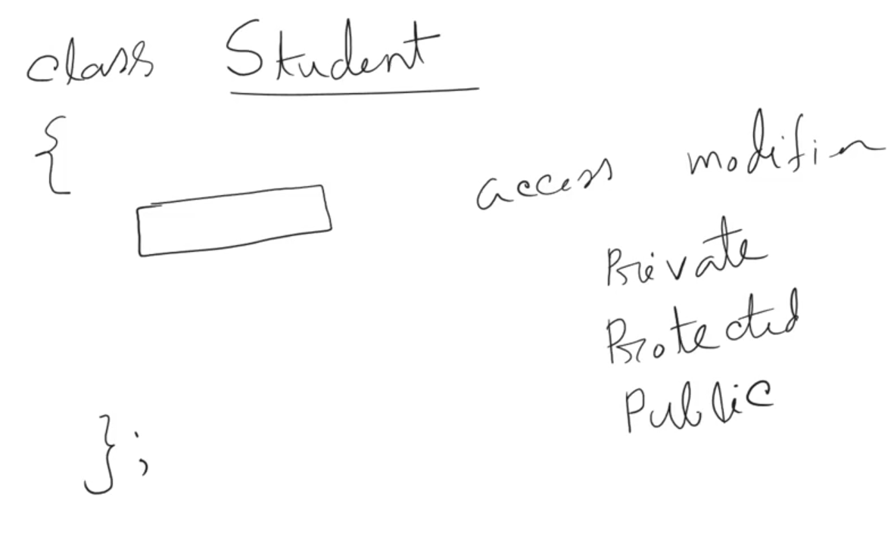
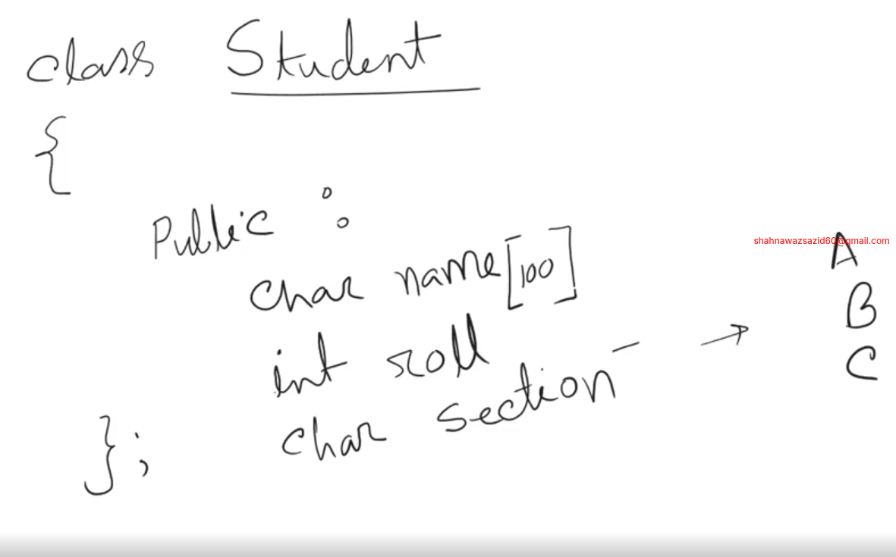
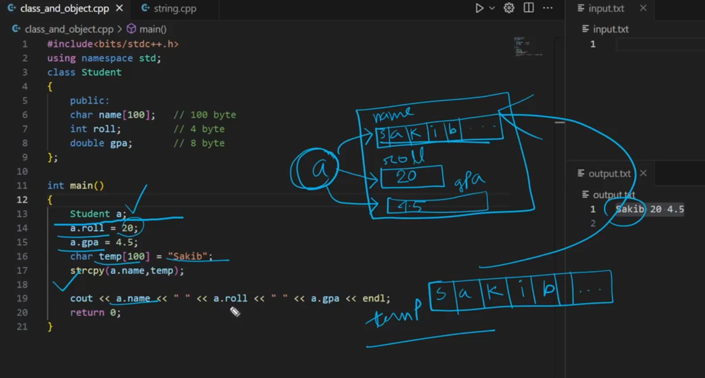
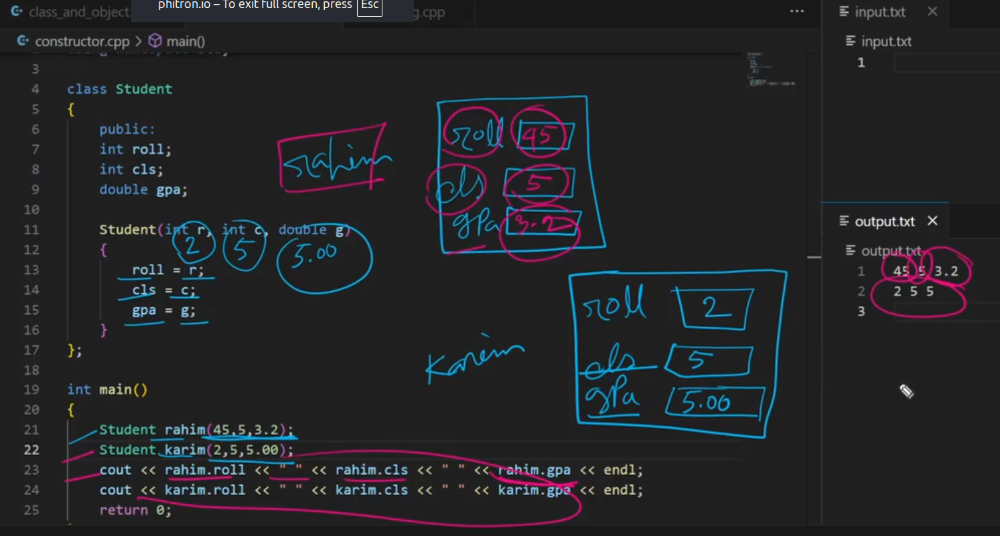

# W_1_M_3_CLASS_AND_OBJECT_IN_CPP

- we will just know class and object that is needed for dsa 
- we will learn class, object , constructor, dynamic object creation and sort function in c++.

## 3_1 What is Class and Object
- built in datatype like number string, boolean etc,
- user defined data type like create e class named sazid it hs age address and all info, these all are defined by user so this is called user defined data type. 
- object is the user defined variable of class .

## 3_2 How to declare class and object





## 3_3, 3_4 Working with class and object



```cpp
#include <bits/stdc++.h>
using namespace std;
class Student
{
public:
    char name[100];
    int roll;
    double gpa;
};
int main()
{
    // write code here
    Student a;
    //a.name = "Sazid"; 
    // we cant do it because its kind of aarray
    char temp[100] = "SAZID";
    strcpy(a.name, temp); // we can do it by using strcpy function
    a.roll = 101;
    a.gpa = 3.75;

    cout << "Name: " << a.name << endl;
    cout << "Roll: " << a.roll << endl;
    cout << "GPA: " << a.gpa << endl;
    return 0;
}
```

```
sakib 10 4.56
rakib 20 4.87
```

```cpp
#include <bits/stdc++.h>
using namespace std;
class Student
{
public:
    char name[100];
    int roll;
    double gpa;
};
int main()
{
    Student a,b;
    cin >> a.name >> a.roll >> a.gpa;
    cin >> b.name >> b.roll >> b.gpa;
    cout << a.name << " " << a.roll << " " << a.gpa << endl;
    cout << b.name << " " << b.roll << " " << b.gpa << endl;
    return 0;
}
```
- what if we try with full name?

```
sakib alabama
10 4.56
rakib balamba
20 4.87
```

```cpp
#include <bits/stdc++.h>
using namespace std;

class Student
{
public:
    char name[100];
    int roll;
    double gpa;
};

int main()
{
    Student a, b;

    cin.getline(a.name, 100);
    cin >> a.roll >> a.gpa;

    cin.ignore(); // clear newline from buffer
    //getchar()

    cin.getline(b.name, 100);
    cin >> b.roll >> b.gpa;

    cout << a.name << " " << a.roll << " " << a.gpa << endl;
    cout << b.name << " " << b.roll << " " << b.gpa << endl;

    return 0;
}
```

## 3_5 Constructor and its Simulation

```cpp
#include<bits/stdc++.h>
using namespace std;

class Student {
    public : 
    int roll;
    int cls;
    double gpa;
};


int main(){
    Student rahim;
    rahim.roll = 101;
    rahim.cls = 10;
    rahim.gpa = 4.00;

    Student karim;
    karim.roll = 102;
    karim.cls = 10;
    karim.gpa = 3.75;

    cout << rahim.roll << " " << rahim.cls << " " << rahim.gpa << endl;
    cout << karim.roll << " " << karim.cls << " " << karim.gpa << endl;
    return 0;
}
```

- these are the repetitive works . to eliminate the repetitive works we will be using constructor.

- constructor is a function. but its not a normal function .
- constructor is always used in class
- constructor has no return type 
- Constructor name should always be same as class name
- constructor gets called automatically 


```cpp
#include<bits/stdc++.h>
using namespace std;

class Student {
    public : 
    int roll;
    int cls;
    double gpa;


    // constructor 
    Student(int r, int c, double g) {
        roll = r;
        cls = c;
        gpa = g;

    }
};


int main(){
    Student rahim(101, 10, 4.00);
    Student karim(102, 10, 3.75);
    // karim.roll = 102;
    // karim.cls = 10;
    // karim.gpa = 3.75;

    cout << rahim.roll << " " << rahim.cls << " " << rahim.gpa << endl;
    cout << karim.roll << " " << karim.cls << " " << karim.gpa << endl;
    return 0;
}
```



- If we take input from user and this will be less shortcut. If we take input the constructor is not useable 

```cpp
#include<bits/stdc++.h>
using namespace std;

class Student {
    public : 
    int roll;
    int cls;
    double gpa;


    // constructor 
    // Student(int r, int c, double g) {
    //     roll = r;
    //     cls = c;
    //     gpa = g;

    // }
};


int main(){
    Student rahim;
    Student karim;
    cin >> rahim.roll >> rahim.cls >> rahim.gpa;
    cin >> karim.roll >> karim.cls >> karim.gpa;


    cout << rahim.roll << " " << rahim.cls << " " << rahim.gpa << endl;
    cout << karim.roll << " " << karim.cls << " " << karim.gpa << endl;
    return 0;
}
```

## 3_6 This keyword and Arrow sign

- constructor variable name should e set different . this will cause some problems like it will always give garbage value. because which value should be taken . if we want to use this we way we will be using `this` keyword and keep variable identical

```cpp
#include<bits/stdc++.h>
using namespace std;

class Student {
    public : 
    int roll;
    int cls;
    double gpa;


    // constructor 
    Student(int roll, int cls, double gpa) {
        this->roll = roll; // this is a pointer which points to the current object  like rahim and karim 
        // (*this).roll = roll; // this is also same as above line
        this->cls = cls;
        this->gpa = gpa;
    }
};


int main(){
    Student rahim(101, 10, 4.00);
    Student karim(102, 10, 3.75);
    // karim.roll = 102;
    // karim.cls = 10;
    // karim.gpa = 3.75;

    cout << rahim.roll << " " << rahim.cls << " " << rahim.gpa << endl;
    cout << karim.roll << " " << karim.cls << " " << karim.gpa << endl;
    return 0;
}
```

## 3_7 Return object from function

```cpp
#include<bits/stdc++.h>
using namespace std;

class Student {
    public : 
    int roll;
    int cls;
    double gpa;

    Student(int roll, int cls, double gpa) {
        this->roll = roll;
        this->gpa = gpa;
    }
};

Student fun(){
    Student karim(102, 10, 3.75);
    return karim;
}
// this is working as static object and we are getting the return like a normal function 

int main(){
    Student rahim(101, 10, 4.00);
    Student obj = fun();
    
    cout << rahim.roll << " " << rahim.cls << " " << rahim.gpa << endl;
    cout << obj.roll << " " << obj.cls << " " << obj.gpa << endl;
    return 0;
}
```

## 3_8 Why we need dynamic object
- if we deal in stack memory the all works will be popped off so all will be removed so we need a dynamic object. 

- dynamic object 
```cpp
#include<bits/stdc++.h>
using namespace std;

class Student {
    public : 
    int roll;
    int cls;
    double gpa;

    Student(int roll, int cls, double gpa) {
        this->roll = roll;
        this->cls = cls;
        this->gpa = gpa;
    }
};

Student* fun(){
    //now this is done in heap memory 
    Student* p = new Student(102, 10, 3.75);
    return p;
}

int main(){
    Student* p = fun();
    cout << (*p).roll << " " << (*p).cls << " " << (*p).gpa << endl;
    return 0;
}
```

## 3_10 Sort function in C++
- ascending sort 
```cpp
#include<bits/stdc++.h>
using namespace std;

int main(){
    int n;
    cin >> n;
    int a[n];
    for(int i = 0; i < n; i++){
        cin >> a[i];
    }
    // sort(starting point, ending point)
    sort(a, a + n);
    for(int i = 0; i < n; i++){
        cout << a[i] << " ";
    }
    return 0;
}  
```

- descending sort 

```cpp
#include<bits/stdc++.h>
using namespace std;

int main(){
    int n;
    cin >> n;
    int a[n];
    for(int i = 0; i < n; i++){
        cin >> a[i];
    }
    // sort(starting point, ending point)
    sort(a, a + n, greater<int>()); // descending sorting 
    for(int i = 0; i < n; i++){
        cout << a[i] << " ";
    }
    return 0;
}  
```